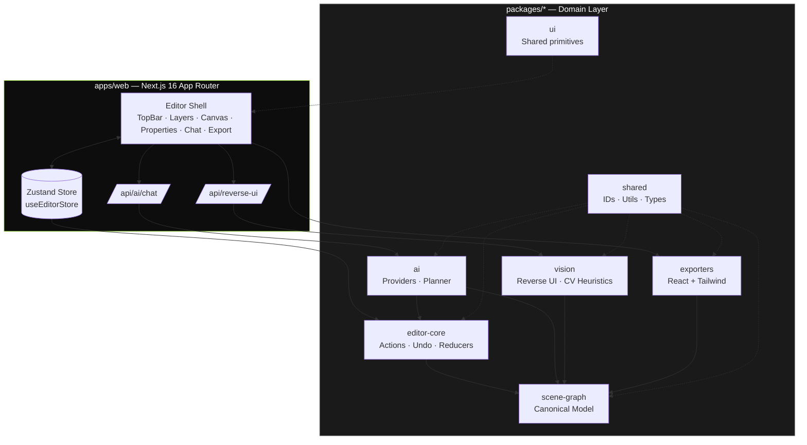
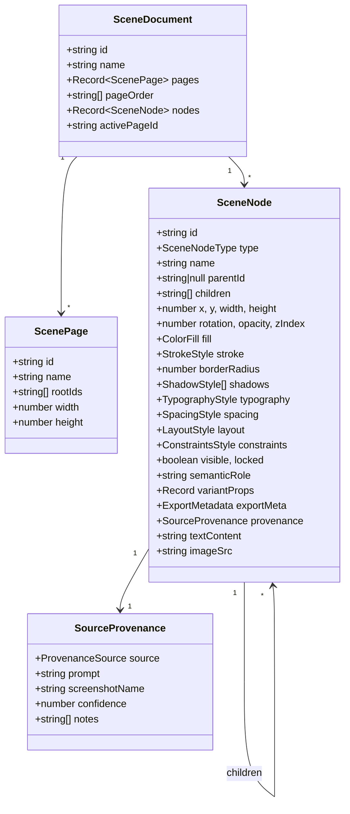
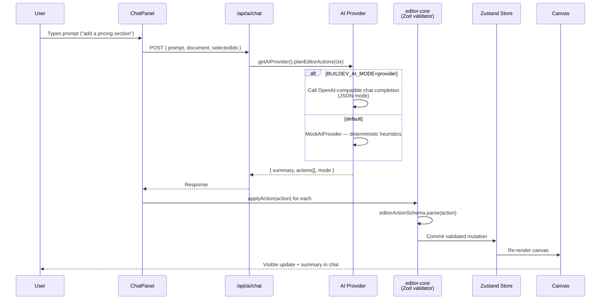
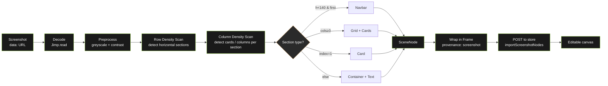
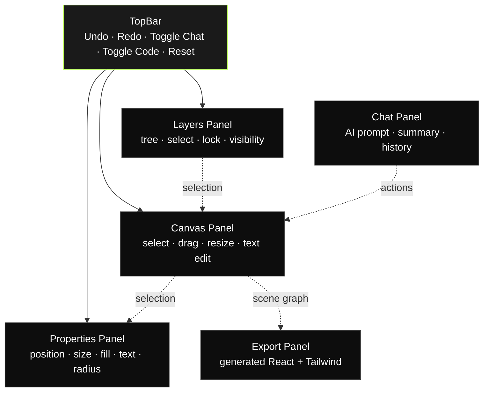
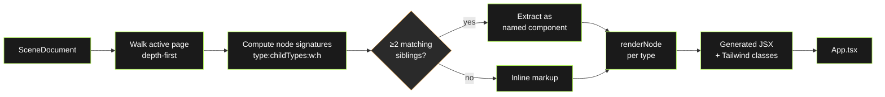
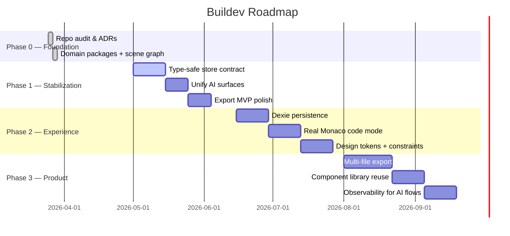

# Buildev — AI UI Compiler & Decompiler


> **Most "AI UI builders" hand you dead code or a flat raster. Buildev hands you a living scene graph.**
> Chat to design it. Drag to refine it. Paste a screenshot to reverse-engineer it. Export it as real React + Tailwind. Same model end-to-end.

[](LICENSE)
[](https://nextjs.org/)
[](https://www.typescriptlang.org/)
[](https://tailwindcss.com/)
[](https://pnpm.io/)
[]()

---

> **If you came here looking for a polished SaaS — leave a star and check back in six months.**
> **If you came here to see how an AI-native UI editor can be designed and shipped honestly, you are in the right place.**

---

## Table of Contents

- [Honest Project Status](#honest-project-status)
- [Demo Video](#demo-video)
- [What is Buildev](#what-is-buildev)
- [Product Positioning](#product-positioning)
- [Core Features](#core-features)
- [System Architecture](#system-architecture)
- [The Scene Graph](#the-scene-graph)
- [AI Pipeline](#ai-pipeline)
- [Reverse UI Engineering Pipeline](#reverse-ui-engineering-pipeline)
- [Editor UI Flow](#editor-ui-flow)
- [Export Pipeline](#export-pipeline)
- [Tech Stack](#tech-stack)
- [Repository Layout](#repository-layout)
- [Getting Started](#getting-started)
- [Environment Variables](#environment-variables)
- [Available Scripts](#available-scripts)
- [Roadmap](#roadmap)
- [Known Issues & Limitations](#known-issues--limitations)
- [Architecture Decision Records (ADRs)](#architecture-decision-records-adrs)
- [Contributing](#contributing)
- [License](#license)

---

## Honest Project Status

> [!WARNING]
> **Buildev is an early preview. Not production. Not finished. Has bugs.**

Let me get the bad news out of the way before you find it yourself:

- **There are bugs.** The repo carries TypeScript drift from a recent monorepo migration. Some legacy panels reference store fields that no longer exist.
- **The AI is a mock by default.** Until you wire `OPENAI_API_KEY` and `BUILDEV_AI_MODE=provider`, every chat response comes from a small deterministic planner. That is on purpose — the UI must never hang on an external call — but you should know it.
- **Reverse UI has no OCR.** It detects layout regions and types them as `Navbar`, `Grid`, `Card`. It does not yet read the text inside them.
- **The exporter is honest-MVP.** Output is layout-faithful but uses arbitrary Tailwind values and absolute positioning. It compiles. It is not yet what you would push to a senior dev's PR review.
- **No real persistence.** State lives in `localStorage`. The Dexie scaffolding exists but is not wired in.
- **No multiplayer, no auth, no billing.** Out of scope.

**So why open the repo?** Because the part that is hard to design later — the canonical model, the validated action boundary between AI and editor, the package layout, the three pipelines that share one source of truth — is already built and reusable. That is the part worth seeing today.

The demo video below shows the working slice end-to-end. The rest of this README explains the architecture honestly enough that a senior engineer can decide in five minutes whether this is interesting to them.

---

## Demo Video

A walkthrough of the current features — chat-to-canvas, manipulation, screenshot import, and code export — is available on YouTube:

[](https://www.youtube.com/watch?v=K9jyzxcf4hk)

> **▶ Watch on YouTube:** https://www.youtube.com/watch?v=K9jyzxcf4hk

---

## What is Buildev

Buildev is an open-source platform for **AI-assisted UI design with an editable canvas and real code export**. The product is built around three pipelines that share a single canonical model:

1. **Chat → Canvas.** A prompt becomes a set of validated editor actions that mutate a semantic scene graph.
2. **Screenshot → Canvas.** An uploaded image is decoded into editable layers and components, not just pixels.
3. **Canvas → Code.** The scene graph compiles into clean React + Tailwind output.

Everything you see, drag, group, or edit lives inside the same scene graph. The canvas, the AI, and the exporter all read and write the same structure, so changes round-trip without going through a lossy translation layer.

### Who this is for

- **Engineers** evaluating how to design an AI-native editor around a single canonical model instead of a flat codegen prompt.
- **Designers** curious about a canvas where AI edits and manual edits are the same primitive under the hood.
- **Contributors** comfortable working on unfinished software with strong opinions about what it should become.

If you are looking for a hosted "design with AI" SaaS, this is not that — yet.

---

## Product Positioning

Buildev is **not** intended to be "another Figma clone." It is intentionally framed as:

| Frame | Meaning |
| --- | --- |
| **AI UI Compiler / Decompiler** | Prompts and screenshots compile down to a semantic scene graph; that scene graph decompiles back to code. |
| **Reference → Editable Canvas** | A reference image (mockup, competitor screenshot, dashboard photo) is reconstructed as a directly-editable canvas, not as a flat raster or a one-shot codegen. |
| **Screenshot → Editable Semantic UI** | Detected regions are typed as `Navbar`, `Grid`, `Card`, `Text` and so on, not as anonymous `<div>`s. |
| **Living Canvas Synced with Code** | The scene graph is the single source of truth. Visual edits, AI edits, and exports all operate on the same model. |

---

## Core Features

| Surface | What it does today | Status |
| --- | --- | --- |
| **Editable canvas** | Select, move, resize, group/ungroup, z-order, duplicate, delete, inline text edit | Working |
| **Layers panel** | Tree of nodes, visibility, lock, reorder | Working |
| **Properties inspector** | Position, size, fill, radius, typography, layout | Working |
| **AI chat (mock)** | Deterministic prompt → editor actions planner | Working |
| **AI chat (provider)** | OpenAI-compatible JSON-mode provider returning validated actions | Working (requires API key) |
| **Reverse UI (screenshot)** | Heuristic block + column detection → editable frame + nodes | Working, low fidelity |
| **React + Tailwind export** | Generates a self-contained `App.tsx` with extracted repeated components | Working, MVP quality |
| **Local persistence** | Editor state persisted via `localStorage` (`buildev-editor-state-v1`) | Working |
| **Undo / Redo** | Action-based history in `editor-core` | Working |
| **Responsive preview** | Device frames (desktop/tablet/mobile) | Partial |
| **Monaco code editor** | Live code/canvas round-trip | Not implemented |
| **Multiplayer / auth / billing** | — | Out of scope for this phase |

---

## System Architecture

Buildev is organized as a **pnpm monorepo** with one Next.js application and a set of domain packages. Each package has a focused responsibility and a typed contract, which is the unit that makes the AI and export surfaces composable instead of tangled.



**Why this shape?**

- The **scene graph** is the canonical model. Everything else is a transformation on it.
- The **editor-core** package owns mutations through validated actions (Zod schemas), so AI-generated edits and user-generated edits go through the same pipe.
- The **AI** and **vision** packages produce actions and nodes that conform to the scene graph contract — they cannot break it.
- The **exporters** package reads the scene graph and emits code. It does not introspect React components.

---

## The Scene Graph

The scene graph is the single source of truth for everything the user sees and edits. Each node carries layout, style, semantic role, and **provenance** (was it created manually, by AI, or reconstructed from a screenshot?). That provenance is what makes auditable round-tripping possible.



### Supported Node Types

`Page` · `Frame` · `Group` · `Rectangle` · `Ellipse` · `Line` · `Text` · `Image` · `Icon` · `Button` · `Input` · `Textarea` · `Checkbox` · `Radio` · `Switch` · `Select` · `Tabs` · `Badge` · `Card` · `Modal` · `Navbar` · `Sidebar` · `List` · `Grid` · `Table` · `Chart` · `Container`

Each node is validated through Zod schemas (see [packages/scene-graph/src/index.ts](packages/scene-graph/src/index.ts)) so corrupt data — including AI-generated mistakes — cannot enter the document.

---

## AI Pipeline

The AI surface follows a "plan → validate → apply" model. The model never mutates the document directly; it returns **actions** that the editor-core validates and applies. This gives Buildev a single audit point for everything the AI does.



### Action Types

The AI can emit (and the user can replay) any of:

- `createNode` — add a new typed node under a parent.
- `setStyles` — patch fill, typography, radius, shadows, layout.
- `generateComponent` — bulk-create a coherent group (e.g. a pricing grid).
- `replaceSubtree` — atomic swap of a subtree (used for "make this a table", screenshot import, full landing seeds).

If the prompt does not match a richer command, the mock provider falls back to leaving a labeled `Text` note on the canvas — so the user always gets a visible, auditable response instead of a silent failure.

---

## Reverse UI Engineering Pipeline

Reverse UI is the most differentiated surface. Pure LLM guessing is too unreliable for layout; pure heuristics cannot infer semantics alone. Buildev uses a **staged hybrid pipeline** (see [ADR-0003](docs/adr/0003-hybrid-reverse-ui-pipeline.md)):



**Why this design?**

- **Determinism + debuggability.** Heuristics are inspectable; a failure mode is reproducible.
- **Graceful degradation.** Works with no LLM access at all.
- **Explicit upgrade path.** OCR (for real text), CV upgrades (for icon detection), and an optional LLM normalization pass can be slotted in as stages without rewriting the pipeline.

**What it does NOT do yet:**

- No OCR — detected text blocks carry placeholder content.
- No icon/glyph recognition.
- No font matching.
- No color extraction beyond palette defaults.

Treat the output as a **layout-faithful editable skeleton**, not as a 1:1 reconstruction.

---

## Editor UI Flow

The editor is a three-column workspace over a top bar. Every panel reads from and writes to the same Zustand store, and the store is the only thing that talks to `editor-core`.



Source: [apps/web/components/editor/editor-app.tsx](apps/web/components/editor/editor-app.tsx)

---

## Export Pipeline

The exporter walks the scene graph, detects repeated sibling subtrees (same type + same child-type signature + same size), and extracts them into reusable components. The output is a single `App.tsx` plus supporting files.



**What is clean about it:** Repeated cards become a real component, not three duplicated blocks.

**What is not clean yet:** Layout still relies on absolute positioning and arbitrary Tailwind values (`w-[384px]`, `left-[48px]`). A future pass needs to translate flex layouts in the scene graph into idiomatic Tailwind utility classes.

---

## Tech Stack

| Layer | Choice | Why |
| --- | --- | --- |
| **Monorepo** | pnpm workspaces | Fast, strict, plays well with Next.js + TS project references |
| **App framework** | Next.js 16 (App Router) | Server actions, route handlers, RSC where it helps |
| **Language** | TypeScript 5.8 (strict) | The scene graph is heavily typed; strict mode catches AI-generated mistakes at validation time |
| **Styling** | Tailwind CSS 4.1 | Direct match for the exporter target |
| **State** | Zustand 5 | Single store, no provider hell, easy to persist |
| **Validation** | Zod 3.24 | All editor actions and node types validated at the boundary |
| **CV / vision** | Jimp | Pure-JS image processing, no native deps |
| **AI** | OpenAI-compatible (configurable base URL/model) + deterministic mock | Works offline and online |
| **Testing** | Vitest 3 + jsdom | Fast unit tests for editor-core and exporters |
| **Lint / format** | ESLint 9 + Prettier 3 | — |
| **Icons** | lucide-react | — |

---

## Repository Layout

```
buildev/
├── apps/
│   └── web/                        # Next.js 16 App Router shell
│       ├── app/
│       │   ├── api/
│       │   │   ├── ai/chat/        # AI planner endpoint
│       │   │   └── reverse-ui/     # Screenshot → scene endpoint
│       │   ├── globals.css
│       │   ├── layout.tsx
│       │   └── page.tsx            # Mounts <EditorApp />
│       ├── components/editor/
│       │   ├── editor-app.tsx
│       │   ├── top-bar.tsx
│       │   ├── layers-panel.tsx
│       │   ├── canvas-panel.tsx
│       │   ├── properties-panel.tsx
│       │   ├── chat-panel.tsx
│       │   └── export-panel.tsx
│       ├── lib/store.ts            # Zustand store + hydration
│       └── public/                 # Logos, marketing assets
│
├── packages/
│   ├── scene-graph/                # Canonical SceneDocument / SceneNode types
│   ├── editor-core/                # Actions, reducers, undo/redo
│   ├── ai/                         # Mock + OpenAI-compatible providers
│   ├── vision/                     # Reverse-UI heuristic pipeline (Jimp)
│   ├── exporters/                  # React + Tailwind codegen
│   ├── ui/                         # Shared UI primitives
│   └── shared/                     # IDs, utils, common types
│
├── docs/
│   ├── product/brief.md
│   ├── architecture/
│   │   ├── system-overview.md
│   │   ├── roadmap.md
│   │   └── progress-log.md
│   └── adr/
│       ├── 0001-adopt-monorepo-and-domain-packages.md
│       ├── 0002-scene-graph-as-canonical-model.md
│       └── 0003-hybrid-reverse-ui-pipeline.md
│
├── pnpm-workspace.yaml
├── tsconfig.base.json
├── vitest.config.ts
└── README.md
```

---

## Getting Started

### Prerequisites

- **Node.js** ≥ 20
- **pnpm** ≥ 10.30 (`npm install -g pnpm`)

### 1. Clone

```bash
git clone https://github.com/isjunrod/Buildev.git
cd Buildev
```

### 2. Install

```bash
pnpm install
```

### 3. Configure environment

```bash
cp .env.example .env
```

The defaults work for the **mock AI mode** out of the box — no API keys required to see the editor running.

### 4. Run

```bash
pnpm dev
```

Open [http://localhost:3000](http://localhost:3000). The editor seeds itself with a fintech landing template on first load.

### 5. Build

```bash
pnpm build
pnpm start
```

### 6. Test

```bash
pnpm test
pnpm typecheck
pnpm lint
```

---

## Environment Variables

| Variable | Default | Purpose |
| --- | --- | --- |
| `NEXT_PUBLIC_APP_URL` | `http://localhost:3000` | Public-facing app URL |
| `NEXT_PUBLIC_ENABLE_AI_FEATURES` | `true` | UI toggle for AI surfaces |
| `NEXT_PUBLIC_ENABLE_AUTH` | `false` | Auth currently out of scope |
| `BUILDEV_AI_MODE` | `mock` | Set to `provider` to use a real OpenAI-compatible model |
| `OPENAI_API_KEY` | — | Required when `BUILDEV_AI_MODE=provider` |
| `OPENAI_BASE_URL` | `https://api.openai.com/v1` | Override for OpenAI-compatible gateways |
| `OPENAI_MODEL` | `gpt-4.1-mini` | Model name used by the provider |

> **Note:** When the provider returns invalid JSON or the API call fails, Buildev silently falls back to the deterministic mock so the UI never hangs. Check the response `mode` field (`"mock"` vs `"provider"`) to confirm which path served the request.

---

## Available Scripts

| Script | What it does |
| --- | --- |
| `pnpm dev` | Run the Next.js dev server (`apps/web`) |
| `pnpm build` | Production build of the web app |
| `pnpm start` | Start the production server |
| `pnpm lint` | ESLint over `apps/web` and `packages/*` |
| `pnpm test` | Vitest run across all packages |
| `pnpm typecheck` | `tsc --noEmit` for the web app |

---

## Roadmap

The phases below match [docs/architecture/roadmap.md](docs/architecture/roadmap.md).



**P0 — Foundation:** Editable canvas, chat → canvas, screenshot → canvas, React+Tailwind export, credible UI.
**P1 — Stabilization:** Additional exporters, parser improvements, design tokens, undo/redo polish, local versioning.
**P2 — Experience:** Recovery from physical photos/posters, real-time collaboration, design systems, plugin system.

**Out of initial scope:** billing · complex auth · enterprise infra · full multiplayer · admin panels · plugin marketplace · cosmetic features.

---

## Known Issues & Limitations

Be aware of these before filing bugs — they are tracked, not surprises:

- **TypeScript drift.** Some panels in legacy folders (`app/`, `components/` at repo root, predating the monorepo migration) reference store fields that no longer exist. `pnpm typecheck` may surface errors there.
- **Two parallel app trees.** The repo currently contains both the pre-monorepo `app/` + `components/` directories at the root and the new `apps/web/...` tree. The active runtime is **only** `apps/web`. The root copies will be removed once the migration concludes.
- **Mock AI is the default.** Until you set `BUILDEV_AI_MODE=provider` and a valid `OPENAI_API_KEY`, all chat responses come from a small deterministic planner. That is intentional — the UI must never hang waiting on an API.
- **Reverse UI has no OCR.** Text in detected sections is a placeholder. Hooking up Tesseract or a vision LLM is on the P2 roadmap.
- **Exporter uses arbitrary Tailwind values.** Positions and sizes are emitted as `left-[NNNpx]` etc. Translating flex layouts to idiomatic utility classes is a known follow-up.
- **No real persistence layer.** State is kept in `localStorage` only. Dexie scaffolding exists in `lib/db/` but is not wired into the editor flow.
- **No multiplayer, no auth, no billing.** Intentionally out of scope.

If you hit something not on this list, please open an issue.

---

## Architecture Decision Records (ADRs)

Buildev documents non-obvious design choices as ADRs so future contributors can trace the *why*, not just the *what*:

| # | Title | Status |
| --- | --- | --- |
| [0001](docs/adr/0001-adopt-monorepo-and-domain-packages.md) | Adopt monorepo and domain packages | Accepted |
| [0002](docs/adr/0002-scene-graph-as-canonical-model.md) | Scene graph as canonical model | Accepted |
| [0003](docs/adr/0003-hybrid-reverse-ui-pipeline.md) | Hybrid heuristic + AI reverse-UI pipeline | Accepted |

Additional design notes live in [docs/architecture/system-overview.md](docs/architecture/system-overview.md) and [docs/architecture/roadmap.md](docs/architecture/roadmap.md).

---

## Contributing

Buildev is open to contributors who are comfortable working on **unfinished software with strong architectural opinions**. The contribution loop:

1. Fork the repository.
2. Create a feature branch: `git checkout -b feat/your-feature`.
3. Make focused changes. **Run `pnpm typecheck`, `pnpm test`, `pnpm lint` before pushing.**
4. Use [Conventional Commits](https://www.conventionalcommits.org/): `feat:`, `fix:`, `refactor:`, `chore:`, `docs:`.
5. Open a PR with a clear description of the *why*.

When in doubt, prefer:
- Editing the **canonical model** (scene graph) over inventing a parallel one.
- Adding an **editor action** over mutating the store directly.
- Writing a **failing test** before a fix.

---

## License

MIT — see [LICENSE](LICENSE).

---

<p align="center">
  <strong>Buildev</strong> — a living UI canvas synced with code.<br/>
  <em>Early preview. Honest about it.</em>
</p>
